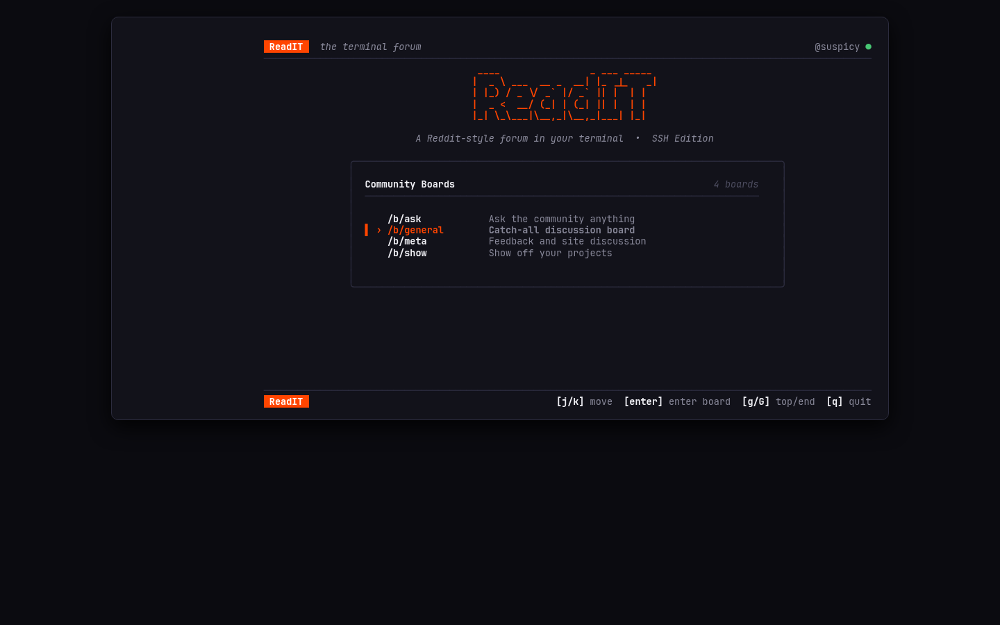
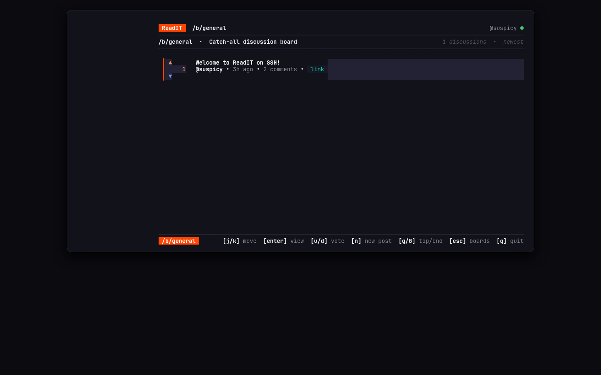
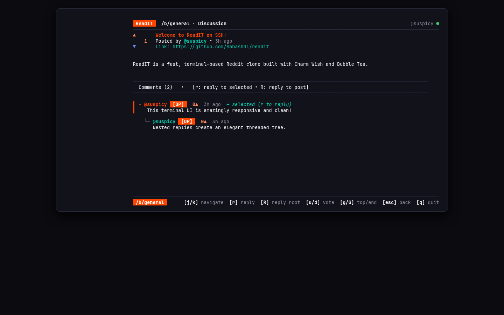
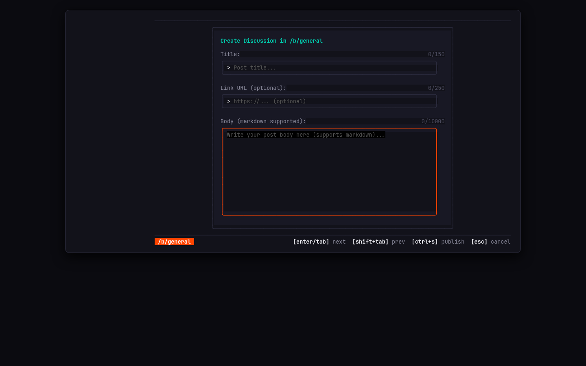

# ReadIT

<div align="center">

```text
 ____                _ ___ _____
|  _ \ ___  __ _  __| |_ _|_   _|
| |_) / _ \/ _` |/ _` || |  | |
|  _ <  __/ (_| | (_| || |  | |
|_| \_\___|\__,_|\__,_|___| |_|
```

**A modern, Reddit-style terminal forum accessible over SSH.**

[](https://go.dev/)
[](https://github.com/charmbracelet/bubbletea)
[](https://github.com/charmbracelet/wish)
[](https://sqlc.dev/)
[](LICENSE)

</div>

---

## Overview

**ReadIT** brings the community discussion experience of Reddit and Hacker News directly to your terminal. It requires **zero client-side installation**—anyone with an SSH client can connect instantly and participate in discussions, browse community boards, upvote or downvote posts, and reply in threaded conversations.

The interface is built with [Charm's](https://charm.sh) Bubble Tea and Lip Gloss, adopting an intentional, high-density design system inspired by Reddit, Lazygit, and modern developer dashboards.

---

## Visual Tour

### Community Boards Directory
The landing experience features a centered application canvas, hero ASCII typography, real-time board counters, and active board selection:

<div align="center">
  
</div>

---

### Discussion Feed with Reddit-Style Vote Columns
Browse posts organized with a 3-line vertical vote indicator (`▲ / score / ▼`), author metadata, relative timestamps, external link badges, and active accent borders:

<div align="center">
  
</div>

---

### Threaded Discussion Tree & Comment Navigation
Engage with full word-wrapped discussion posts and hierarchical comment trees featuring Unicode branch glyphs (`└─`), `[OP]` author badges, and interactive comment cursors:

<div align="center">
  
</div>

---

### In-Terminal Discussion & Reply Composer
Compose new posts and replies using floating modal dialogs with nested input boxes, real-time character counters, and fluid focus navigation:

<div align="center">
  
</div>

---

## Key Features

- **Zero Client Setup**: Accessible over standard SSH (`ssh -p 2222 localhost`). No local CLI binaries, runtimes, or dependencies required for users.
- **SSH Public-Key Identity**: Automatic onboarding on first connect—associates your SSH key with an alphanumeric handle without passwords.
- **Reddit / Lazygit Design System**: Centered application canvas, semantic dark palette, clean hairline borders, and responsive scaling from 80×24 up to 4K terminals.
- **Vertical Vote Rhythm**: Reddit-style vertical vote block (`▲ score ▼`) with toggleable votes (upvote or downvote twice to return to neutral `0`).
- **Deep Threaded Comments**: Indented recursive conversation trees with author differentiation, comment selection cursor, and targeted replies.
- **Hybrid Post & Comment Deletion**: Safe, Reddit/Hacker News style deletion model (`x`). Empty posts and leaf comments are hard-deleted for zero storage waste; items with active discussion trees are soft-deleted with scrubbed payloads and `[deleted]` placeholders to maintain thread continuity without orphaned replies.
- **Security & DoS Hardened**:
  - ANSI/VT100 escape code sanitization on all user strings to prevent terminal injection.
  - Recursion depth ceilings (`depth < 15`) on comment tree queries to prevent stack/memory exhaustion.
  - PostgreSQL connection budgeting with strict `statement_timeout` and idle transaction bounds.
  - Wish SSH session timeouts to prevent PTY file descriptor exhaustion.

---

## Keyboard Navigation

| Context | Key | Action |
| :--- | :--- | :--- |
| **Global** | `q` / `Ctrl+C` | Quit session |
| **Global** | `Esc` | Back / Cancel modal / Pop view |
| **Navigation** | `j` / `↓` | Move cursor down |
| **Navigation** | `k` / `↑` | Move cursor up |
| **Navigation** | `g` / `Home` | Jump to top of list or thread |
| **Navigation** | `G` / `End` | Jump to bottom of list or thread |
| **Board List** | `Enter` | Enter selected board |
| **Post Feed** | `Enter` | View discussion thread & comments |
| **Post Feed** | `s` | Cycle feed sort order (`hot` → `new` → `top`) |
| **Post Feed** | `c` | Cycle flair filter (`all` → `general` → `discussion` → `question` → `showcase` → `guide` → `news`) |
| **Post Feed** | `n` | Create new discussion in active board |
| **Post / Comment** | `x` | Delete post or comment (confirmation modal) |
| **Voting** | `u` | Upvote post or comment (press again to reset to 0) |
| **Voting** | `d` | Downvote post or comment (press again to reset to 0) |
| **Discussion** | `s` | Cycle comment sort order (`top` → `new` → `old`) |
| **Discussion** | `r` | Reply to currently highlighted comment |
| **Discussion** | `R` | Reply directly to root post |
| **Forms / Modals** | `Enter` / `Tab` | Advance to next field |
| **Forms / Modals** | `Shift+Tab` | Return to previous field |
| **Forms / Modals** | `h` / `l` or `←` / `→` / `Space` | Cycle category / flair selector |
| **Forms / Modals** | `Ctrl+S` | Submit and publish |

---

## Quickstart & Local Development

### Prerequisites
- [Go](https://go.dev/) 1.24+
- [Docker](https://www.docker.com/) and Docker Compose (for PostgreSQL)
- An SSH client (`ssh`)

### 1. Clone the Repository
```bash
git clone https://github.com/Sahas001/readit.git
cd readit
```

### 2. Launch PostgreSQL & Apply Migrations
```bash
# Start PostgreSQL container
make docker-up

# Run database schema migrations
make migrate-up
```

### 3. Build & Run the SSH Server
```bash
make run
```
The server will generate an ED25519 host key in `.ssh/host_key` (if not already present) and start listening on port `2222`.

### 4. Connect to ReadIT
Open another terminal window and connect:
```bash
ssh -p 2222 localhost
```
On your first connection, choose your handle (3–20 alphanumeric characters) and begin exploring!

---

## Architecture & Technology Stack

```text
┌─────────────────────────────────────────────────────────────┐
│                       SSH Client                            │
│                 (OpenSSH / Terminal PTY)                    │
└──────────────────────────────┬──────────────────────────────┘
                               │ SSH Connection (Port 2222)
┌──────────────────────────────▼──────────────────────────────┐
│                    Charm Wish SSH Server                    │
│   • Public-Key Authentication  • Session Idle Timeouts      │
│   • Terminal PTY Window Sizing • Context Cancellation       │
└──────────────────────────────┬──────────────────────────────┘
                               │ tea.Program (per session)
┌──────────────────────────────▼──────────────────────────────┐
│               Bubble Tea & Lip Gloss TUI                    │
│   • Elm Architecture (Model-Update-View)                    │
│   • Semantic Theme System & Centered Responsive Shell       │
│   • Threaded Tree Viewport & Form Controls                  │
│   • SingleLine & Text ANSI Escape Sanitization              │
└──────────────────────────────┬──────────────────────────────┘
                               │ pgxpool Queries
┌──────────────────────────────▼──────────────────────────────┐
│              PostgreSQL Persistence (sqlc)                  │
│   • Bounded Recursive CTEs     • Connection Statement Guard │
│   • Keyset Pagination          • Atomic Score Recalculation │
└─────────────────────────────────────────────────────────────┘
```

- **TUI Layer**: [Bubble Tea](https://github.com/charmbracelet/bubbletea), [Lip Gloss](https://github.com/charmbracelet/lipgloss), [Bubbles](https://github.com/charmbracelet/bubbles).
- **SSH Layer**: [Charm Wish](https://github.com/charmbracelet/wish) with public-key middleware.
- **Database Layer**: PostgreSQL 16, [pgx/v5](https://github.com/jackc/pgx), [sqlc](https://sqlc.dev/) for type-safe query generation, [Goose](https://github.com/pressly/goose) for schema migrations.
- **Visual Verification**: Custom headless Chrome rasterizer (`scripts/tui-screen.sh`) driving visual QA inspections in persistent tmux sessions.

---

## Testing & Quality Assurance

Run the automated Go test suite:
```bash
go test -v ./...
```

Capture a high-resolution PNG screenshot of an active tmux session:
```bash
make tui-screen TARGET=dev OUT=assets/screen.png
```

---

## Engineering Ensemble Directives

This project is developed under an ensemble of specialized workspace autonomous agents governed by [`AGENTS.md`](AGENTS.md):
- **`pessimistic-lead`**: Tech & Security Lead guarding against terminal escape injection, DoS vectors, and query bounds.
- **`tui-ux-engineer`**: TUI Creative Engineer maintaining design tokens, visual hierarchy, and responsive layouts.
- **`tui-qa-tester`**: Quality Assurance Engineer driving autonomous tmux navigation and multimodal visual inspection.
- **`git-expert`**: Git & Release Engineer enforcing staging hygiene and Conventional Commits.

---

## License

This project is licensed under the MIT License. See [LICENSE](LICENSE) for details.
