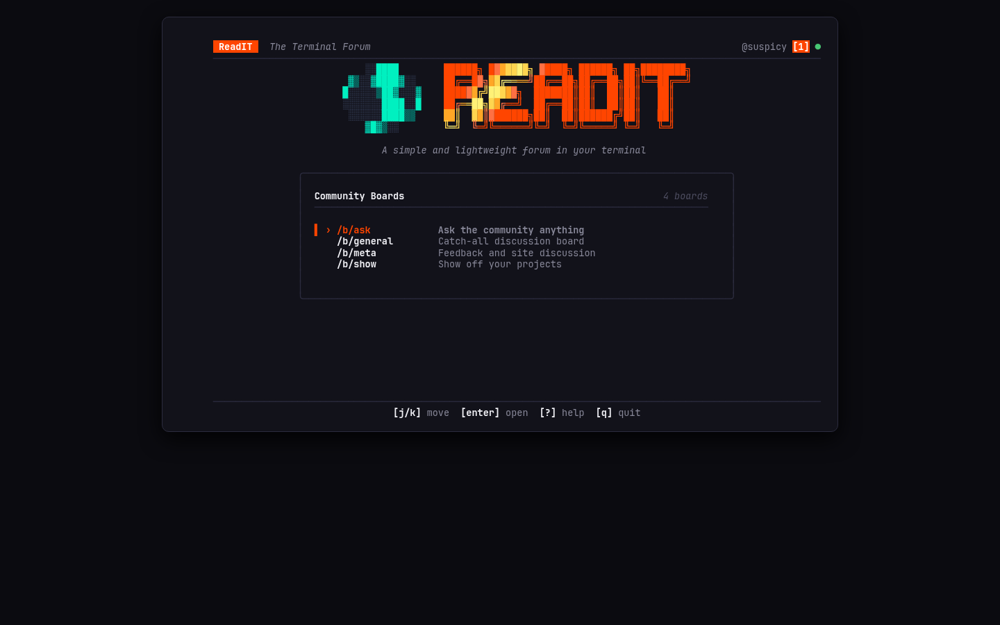
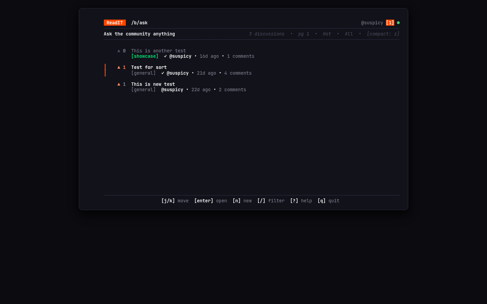
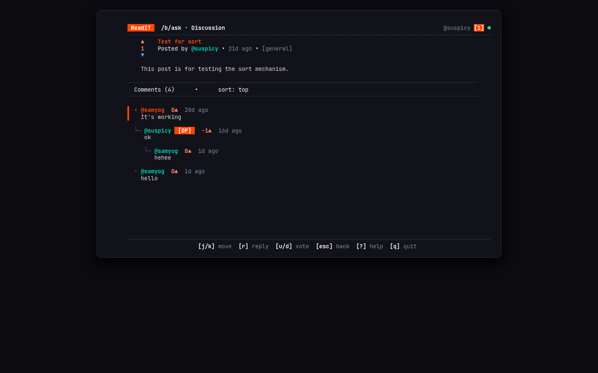
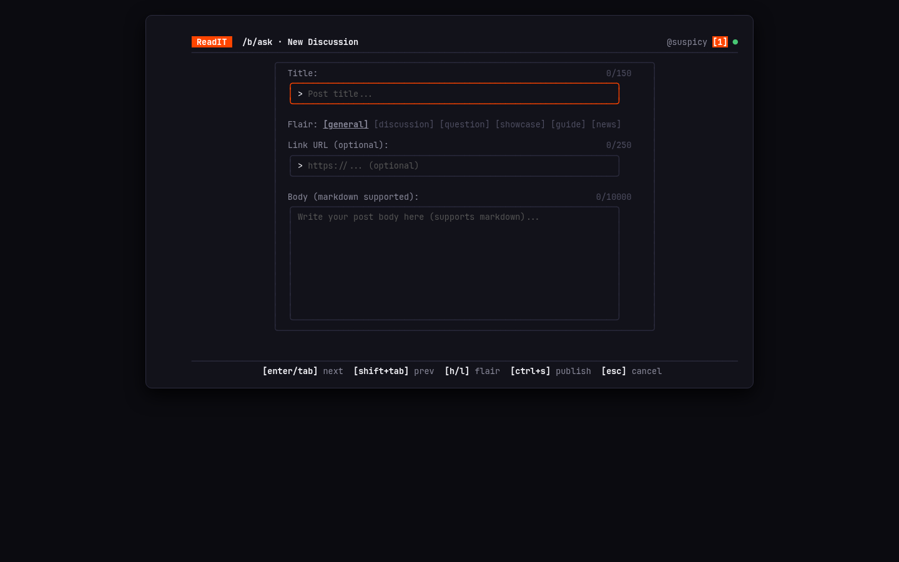
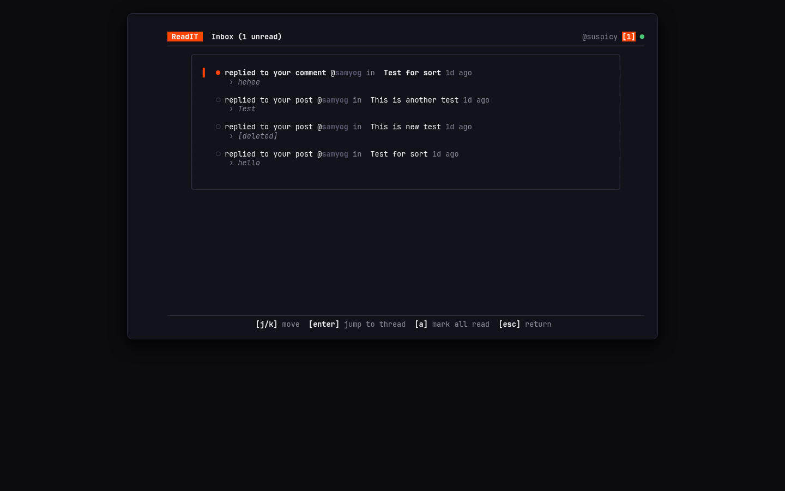
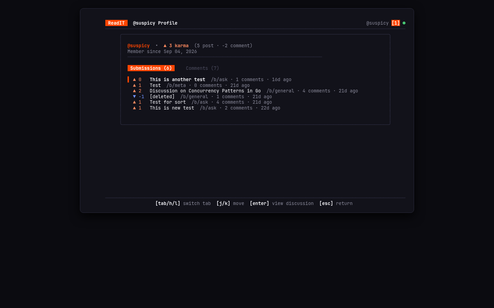

# ReadIT

<div align="center">

```text
 ____                _ ___ _____
|  _ \ ___  __ _  __| |_ _|_   _|
| |_) / _ \/ _` |/ _` || |  | |
|  _ <  __/ (_| | (_| || |  | |
|_| \_\___|\__,_|\__,_|___| |_|
```

**A simple, Reddit-style discussion forum you access over SSH.**

[](https://go.dev/)
[](https://github.com/charmbracelet/bubbletea)
[](https://github.com/charmbracelet/wish)
[](https://sqlc.dev/)

</div>

---

## What is ReadIT?

**ReadIT** brings Reddit and Hacker News discussions directly to your terminal. 

There is **nothing to download or install** on your machine. All you need is an SSH client. Connect in seconds, pick a username, and start reading posts, voting, and joining discussions without opening a browser or creating another password.

Built with Go, [Charm's](https://charm.sh) Bubble Tea, Lip Gloss, Glamour, and PostgreSQL.

---

## Visual Tour

### 1. Community Boards & Landing
Connect over SSH to see active boards, community stats, a centered layout, and an animated ASCII Earth globe:

<div align="center">
  
</div>

---

### 2. Discussion Feed
Browse posts with vertical vote counters (`▲ / score / ▼`), colored flair badges (`[general]`, `[showcase]`, etc.), author names, timestamps, and compact/card density options:

<div align="center">
  
</div>

---

### 3. Threaded Comments & Markdown
Read full posts rendered in clean terminal Markdown. Follow nested reply trees with `[OP]` author badges, tree branches (`└─`), and comment indicators:

<div align="center">
  
</div>

---

### 4. Post & Reply Composer
Write posts and replies using in-terminal modal dialogs with real-time character counters, flair selectors, and full keyboard navigation:

<div align="center">
  
</div>

---

### 5. Reply Notifications & Inbox
See when people reply to your posts or comments with an unread alert in the top bar (`@you [1] ●`). Open the inbox (`i`) to read replies and jump straight to the conversation:

<div align="center">
  
</div>

---

### 6. User Profiles & Karma
View your profile (`p`) or inspect any author (`P`). Track your total post and comment karma, member join date, and browse past submissions and comments using tabs:

<div align="center">
  
</div>

---

## Features

- **No Install Needed**: Just connect using standard SSH (`ssh readit.org` or `ssh -p 2222 localhost`). No CLI packages to install.
- **SSH Key Login**: Your SSH public key logs you in automatically. No passwords, no verification emails, and no passwords to leak.
- **Clean Terminal Interface**: Centered design that scales cleanly from small 80×24 terminals up to large widescreen displays.
- **Reddit-Style Voting**: Upvote (`u`) or downvote (`d`) posts and comments. Press again to undo your vote.
- **Threaded Comment Trees**: Clear indented conversation trees that show who is replying to whom.
- **Terminal Markdown**: Posts and comments support code blocks, bold, italics, quotes, and lists using Glamour.
- **Notifications & Inbox (`i`)**: Get alerted in the header when someone replies to you. Hit Enter to jump right to that comment in the thread.
- **Profiles & Karma (`p`)**: See your post karma, comment karma, and browse your history with `Tab`.
- **Feed Tools**: 
  - Switch between comfortable cards and 1-line compact mode (`z`).
  - Sort by Hot, New, or Top (`s`).
  - Filter by colored category flairs (`c`).
  - Mark discussions as read (`m`) or hide read posts for a fresh feed (`H`).
- **Safe Deletion (`x`)**: If an author deletes a post that has active comments, replies stay intact while empty discussions clean themselves up automatically.
- **Built-in Protection**: Input text is filtered to prevent malicious terminal escape codes, an anti-spam cooldown prevents flooding, and query limits keep the server responsive.

---

## Keyboard Shortcuts

| Context | Key | What It Does |
| :--- | :--- | :--- |
| **Everywhere** | `?` | Show keyboard help cheatsheet |
| **Everywhere** | `i` | Open notification inbox |
| **Everywhere** | `p` | Open your profile & karma overview |
| **Everywhere** | `q` / `Ctrl+C` | Quit |
| **Everywhere** | `Esc` | Go back / Close modal |
| **Navigation** | `j` / `↓` | Move down |
| **Navigation** | `k` / `↑` | Move up |
| **Navigation** | `Ctrl+D` / `Ctrl+U` | Half-page jump down / up |
| **Navigation** | `g` / `Home` | Jump to the very top |
| **Navigation** | `G` / `End` | Jump to the very bottom |
| **Boards** | `Enter` | Enter selected board |
| **Post Feed** | `Enter` | Open discussion thread |
| **Post Feed** | `z` | Toggle view: **Comfortable card** vs **Compact 1-line** |
| **Post Feed** | `]` / `[` | Next / Previous page |
| **Post Feed** | `m` | Mark as read / unread |
| **Post Feed** | `H` | Hide all read posts |
| **Post Feed** | `/` | Search posts in the board |
| **Post Feed** | `s` | Cycle sort order (`hot` → `new` → `top`) |
| **Post Feed** | `c` | Filter by flair (`all` → `general` → `discussion` → `question` → `showcase` → `guide` → `news`) |
| **Post Feed** | `n` | Create a new post |
| **Post / Comment** | `x` | Delete post or comment |
| **Voting** | `u` | Upvote (press again to reset) |
| **Voting** | `d` | Downvote (press again to reset) |
| **Discussion** | `s` | Cycle comment sort (`top` → `new` → `old`) |
| **Discussion** | `P` | View highlighted author's profile |
| **Discussion** | `r` | Reply to highlighted comment |
| **Discussion** | `R` | Reply directly to the main post |
| **Inbox** | `Enter` | Jump directly to that comment in the thread |
| **Inbox** | `a` | Mark all notifications as read |
| **Profile** | `Tab` / `h` / `l` | Switch between Submissions and Comments |
| **Profile** | `Enter` | Open the selected post or comment |
| **Forms** | `Enter` / `Tab` | Next field |
| **Forms** | `Shift+Tab` | Previous field |
| **Forms** | `h` / `l` or `←` / `→` | Change post flair |
| **Forms** | `Ctrl+S` | Submit and publish |

---

## Quickstart & Local Setup

### Requirements
- [Go](https://go.dev/) 1.24+
- [Docker](https://www.docker.com/) and Docker Compose (for PostgreSQL)
- An SSH client (`ssh`)

### 1. Clone the repository
```bash
git clone https://github.com/Sahas001/readit.git
cd readit
```

### 2. Start PostgreSQL & apply database migrations
```bash
# Start PostgreSQL database container
make up

# Run database migrations
make migrate-up
```

### 3. Run the server
```bash
make run
```
The server will create a host key in `.ssh/host_key` (if needed) and listen on port `2222`.

### 4. Connect to ReadIT
In another terminal, connect using SSH:
```bash
make ssh-test
# or: ssh -p 2222 localhost
```
Pick your username (3–20 characters) on first connect, and you're in!

---

## How It Works

```text
┌─────────────────────────────────────────────────────────────┐
│                       SSH Client                            │
│           (Your local terminal: OpenSSH / Kitty / iTerm)    │
└──────────────────────────────┬──────────────────────────────┘
                               │ SSH connection on port 2222
┌──────────────────────────────▼──────────────────────────────┐
│                    Wish SSH Server                          │
│   • Checks your SSH public key (no passwords required)      │
│   • Manages session timeouts and window sizes               │
└──────────────────────────────┬──────────────────────────────┘
                               │ Interactive TUI session
┌──────────────────────────────▼──────────────────────────────┐
│                 Bubble Tea & Lip Gloss                      │
│   • Handles keystrokes (j, k, u, d, r, enter)               │
│   • Renders terminal Markdown with Glamour                  │
│   • Cleans user text to keep terminals secure               │
└──────────────────────────────┬──────────────────────────────┘
                               │ Type-safe database queries
┌──────────────────────────────▼──────────────────────────────┐
│                    PostgreSQL 16                            │
│   • Fast cursor-based pagination (no lag on deep pages)     │
│   • Indented comment trees with depth limits                │
│   • Notifications and profile karma                         │
└─────────────────────────────────────────────────────────────┘
```

- **TUI & Styling**: [Bubble Tea](https://github.com/charmbracelet/bubbletea), [Lip Gloss](https://github.com/charmbracelet/lipgloss), [Glamour](https://github.com/charmbracelet/glamour).
- **SSH**: [Charm Wish](https://github.com/charmbracelet/wish) with public key authentication.
- **Database**: PostgreSQL 16 with [sqlc](https://sqlc.dev/) for compile-time safe queries and [Goose](https://github.com/pressly/goose) for schema migrations.

---

## Testing & Quality

Run the automated test suite:
```bash
go test -v ./...
```

Capture a high-resolution PNG screenshot of an active tmux session:
```bash
make tui-screen TARGET=dev OUT=assets/screen.png
```

---

## License

This project is licensed under the MIT License. See [LICENSE](LICENSE) for details.
